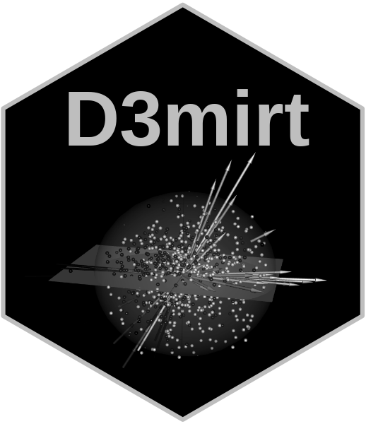

<div align="center">



</div>

# `D3MIRT` Modeling

The `D3mirt` analysis is based on descriptive multidimensional item
response theory (DMIRT; Reckase, 2009, 1985; Reckase & McKinley, 1991)
and can be used to analyze dichotomous and polytomous items to measure
latent traits (denoted $\theta$) in a three-dimensional ability space.
The method is foremost visual and illustrates item characteristics with
the help of vector geometry.

In DMIRT analysis, it is assumed that items in a multidimensional
ability space can measure single or multiple latent traits (Reckase,
2009, 1985). This assumption is realized in the *compensatory model*,
i.e., a type of measurement model that uses linear combinations of
$\theta$-values for ability assessment (Reckase, 2009). DMIRT builds on
the results from the former model and seeks to maximize item
discrimination in the latent space by relaxing the assumption of
unidimensionality. The method is *descriptive* because the results
describe both the strength of discrimination of the items and the extent
to which the items are unidimensional, i.e., that the items discriminate
on one dimension only, or are within-multidimensional, i.e., that the
maximum item discrimination is reached when the item measures more than
one dimension.

Regarding vector orientation, the angle of the vector arrows indicates
what traits, located along the axes in the model, an item measures
(Reckase, 2009, 1985; Reckase & McKinley, 1991). For instance, in a
two-dimensional space, an item is *unidimensional* if its item vector
arrow is at $0°$ with respect to one of the axes in the model and $90°$
with respect to the other. Such an item describes a single trait only.
In contrast, an item is perfectly *within-multidimensional* if its item
vector arrow is oriented at $45°$ in relation to the axes in the model.
Such an item describes both traits in the model equally well. The same
criteria are extended to the $n$-dimensional case.

The DMIRT approach uses two types of item models depending on item type.
If dichotomous items are used, the analysis is based on the
multidimensional two-parameter logistic model (M2PL) (McKinley &
Reckase, 1983; Reckase, 1985). If polytomous items are used, the
analysis is extended to the multidimensional two-parameter graded
response model (MGRM; Muraki & Carlson, 1995). The method is, therefore,
limited to items that fit these item models.

The estimation begins by first fitting and extracting the loadings $a$
and difficulty parameters $d$ from a compensatory model. Next, the DMIRT
estimation takes the former estimates and computes the multidimensional
discrimination ($MDISC$) parameter and the multidimensional difficulty
($MDIFF$) parameter used to locate the items in a multidimensional
vector space.

The $MDIFF$ is interpreted similarly to the difficulty parameter in the
unidimensional model. It shows the level of ability required for a
higher or correct response, defined as the distance from the origin.
Note that if polytomous items are used, such as Likert items, the items
will be represented by multiple vector arrows, one for each response
function. The $MDIFF$ will then show an item’s multidimensional range of
difficulty as located in the latent trait space.

The $MDISC$ shows the highest level of discrimination an item can
achieve in the multidimensional latent model. It is, therefore, a global
item characteristic referring only to the discrimination achieved in the
specific direction of the item in the latent space. The $MDISC$ score is
visualized in the graphical output by scaling the length of the vector
arrows (longer arrows indicate higher discrimination and vice versa),
which in turn describe the domain of item response functions.

In `D3mirt`it also possible to use constructs in the analysis.
Constructs, in this context, refer to the assumption that a subset of
items or a particular orientation in the model space can measure a
higher-order latent variable. This is implemented in `D3mirt` as
optional vectors whose orientation is either calculated as the average
direction of a subset of items (from all items down to a single item) or
indicated by spherical coordinates. A construct vector will, therefore,
point in the direction of the maximum slope of what we might think of as
an imaginary item response function indicated by the items or
coordinates chosen by the user based on exploratory or theoretical
reasons.

If constructs are used, the output will include reporting the
directional discrimination ($DDISC$) parameter that shows how well the
items discriminate, assuming that they measure one of the constructs
used in the analysis. That is, while the $MDISC$ represents the maximum
level of discrimination in the model, the $DDISC$ represents the local
discrimination that makes it possible to compare item discrimination in
a specific direction set by the constructs. The constructs are,
therefore, like unidimensional models nested in the multidimensional
latent space and are visually represented with construct vector arrows
scaled to an arbitrary length.

# Overview

The package includes the following main functions.

- `modid()`: D3mirt Model Identification
- `D3mirt()`: 3D DMIRT Model Estimation
- `plot()`: Graphical Output for `D3mirt()`

## Installation

You can install the `D3mirt` package from CRAN, or try the development
version of the package, by using the following codes for `R`.

``` r
# Install from CRAN depository
install.packages('D3mirt')

# Install the development version from GitHub
# install.packages("devtools")
# To include package vignette in the installation, add: build_vignettes = TRUE
devtools::install_github("ForsbergPyschometrics/D3mirt")
```

In what follows, the `D3mirt` procedure, including the main functions
and some of the more essential arguments, will be briefly described
using the built-in data set “anes0809offwaves”. The data set
($N = 1046, M_{age} = 51.33, SD = 14.56, 57\%$ Female) is a subset from
the American National Election Survey (ANES) from the 2008-2009 Panel
Study Off Wave Questionnaires, December 2009 (DeBell, et al, 2010;
<https://electionstudies.org/data-center/2008-2009-panel-study/>). All
items measure moral preferences and are positively scored of Likert
type, ranging from 1 = *Strongly Disagree* to 6 = *Strongly Agree*.
Demographic variables include age and gender (male/female).

The D3mirt approach largely consists of the following three steps:

1.  Model Identification
2.  D3mirt model estimation
3.  Plotting

Please see the vignette included in the package for more details on the
`D3mirt` package, including extended examples of analysis and functions.

# 1. Model Identification

As a first step in the analysis, the three-dimensional compensatory
model must be identified (Reckase, 2009). In the three-dimensional case,
this implies identifying the $x$ and $y$-axis in the DMIRT model by
selecting two items from the item set. The first item should not load on
the second and third axes ($y$ and $z$-axes), while the second item
should not load on the third axis ($z$). Consequently, if the model is
not known beforehand, it is necessary to explore the data with
exploratory factor analysis (EFA), preferably with the help of the EFA
methods suitable for DMIRT.

The `modid()` function was designed to help with this step in the
process. In brief, the function first performs an EFA based on
multidimensional item response theory. It then selects items so that the
strongest loading item, from the strongest factor, is always parallel
with the x-axis, and the remaining items follow thereafter. This helps
make the result maximally interpretable while also avoiding imposing an
unempirical structure on the data.

Note that the EFA is only used to find model identification items that
meet the necessary DMIRT model specification requirements. The EFA model
itself is discarded after this step in the procedure. This implies that
the rotation method is less crucial, and the user is encouraged to try
different rotation methods and compare the results.

Begin by loading the item data. Note that all outputs are available as
ready-made package files that can be loaded directly into the R session.

``` r
# Load Package
library(D3mirt)
# Load data
data("anes0809offwaves")
x <- anes0809offwaves
x <- x[, 3:22] # Remove columns for age and gender
```

The `modid()` can take in raw item data or a data frame with item factor
loadings. In the default mode (`efa = TRUE`), using raw data, the
function performs an EFA using with the help of the `mirt()` function,
from the `mirt` package (Chalmers, 2012), with three factors as the
default (`factors = 3`). After sorting the results following the model
identification procedure, the function finishes by presenting the model
identification items. The function throws an error if no items can be
located. Note that it is possible to use available factor loadings
assigned to a data frame in the function call. This can be done by
setting `efa` to `FALSE`, which allows the function to skip the EFA and
jump directly to the model identification procedure.

The output consists of an $S3$ object of class `modid` containing data
frames with model identification items, order of factor strength (based
on sum of squares), and item factor loadings. The function has two
arguments: the *lower* and *upper* bound. In brief, the lower bound
increases the item pool used in the procedure, while the upper bound
acts as a filter that removes items that do not meet the necessary
statistical requirements. This implies that the upper bound should not
generally be manipulated.

``` r
# Optional: Load the EFA data for this example directly from the package file
load(system.file("extdata/id.Rdata", package = "D3mirt"))
```

``` r
# Call to modid() with x, containing factors scores from the EFA
# Observe that the efa argument is set to false 
id <- modid(x)
```

``` r
summary(id)
#> 
#> modid: 20 items and 3 factors
#> 
#> Model identification items:
#> Item 1 W7Q3 
#> Item 2 W7Q20 
#> 
#>       Item.1    ABS
#> W7Q3  0.8547 0.0174
#> W7Q5  0.8199 0.0648
#> W7Q1  0.7589 0.0772
#> W7Q10 0.7239 0.0854
#> 
#>       Item.2    ABS
#> W7Q20 0.7723 0.0465
#> W7Q19 0.6436 0.0526
#> W7Q18 0.6777 0.0782
#> 
#>    SS Loadings
#> F2      5.3505
#> F1      2.1127
#> F3      1.6744
#> 
#>            F2      F1      F3
#> W7Q1   0.7589  0.0407 -0.0365
#> W7Q2   0.8901 -0.0263 -0.0838
#> W7Q3   0.8547 -0.0096 -0.0078
#> W7Q4   0.6628  0.0272  0.1053
#> W7Q5   0.8199 -0.0390 -0.0258
#> W7Q6   0.6654  0.0525  0.1054
#> W7Q7   0.5604 -0.0148  0.2087
#> W7Q8   0.5731  0.0390  0.1966
#> W7Q9   0.6151  0.0697  0.0918
#> W7Q10  0.7239  0.0371 -0.0483
#> W7Q11  0.2085  0.0959  0.5488
#> W7Q12  0.0755 -0.0853  0.5559
#> W7Q13 -0.0176 -0.0153  0.7654
#> W7Q14 -0.0407  0.1439  0.5629
#> W7Q15  0.1087  0.4556 -0.1111
#> W7Q16  0.1759  0.2100  0.1152
#> W7Q17  0.2160  0.5816  0.0261
#> W7Q18 -0.0560  0.6777 -0.0782
#> W7Q19  0.0589  0.6436  0.0526
#> W7Q20 -0.0735  0.7723  0.0465
```

The `summary()` function prints the number of items and the number of
factors used in the analysis together with the suggested model
identification items. As can be seen, the items suggested by `modid()`
are the items “W7Q3” and “W7Q20”. The output also includes data frames
that hold all the model identification items (`Item.1...Item.n`)
selected by `modid()` together with the items’ absolute sum score
(`ABS`), one frame for the sum of squares for factors sorted in
descending order, and one frame for item factor loadings.

The order of the factors follows the model identification items so that
item 1 comes from the strongest factor (sorted highest up), item 2 from
the second strongest (sorted second), and so on. The absolute sum scores
indicate statistical fit to the structural assumptions of the DMIRT
model, and the items are sorted with the lowest absolute sum score
highest up. Thus, the top items are the items that best meet the
necessary statistical requirements for the model identification. For a
three-dimensional model, this implies that the item highest up in the
first data frame should be used to identify the $x$-axis and the item
highest up in the second data frame should be used to identify the
$y$-axis, and so on. See the package vignette for more on the model
identification procedure (e.g., troubleshooting, criteria, or
limitations).

# 2. D3mirt Model Estimation

The `D3mirt()` function holds two built-in models. The first model is
the default model, i.e., the three-dimensional compensatory model, and
the latter is the *orthogonal model*, i.e., a restricted model in which
the assumption of within-multidimensionality is removed. In this
context, *orthogonal* refers to the strict perpendicular orientation of
the items in the latent space. The choice of model depends on the vector
used in the `modid` argument when calling `D3mirt()` (see examples
below).

Calling `D3mirt()` returns an $S3$ object of class `D3mirt` with lists
containing $a$ and $d$ from the compensatory model, and the $MDISC$, and
$MDIFF$ parameters, direction cosines, and spherical coordinates for the
item vectors from the DMIRT model. Regarding the latter, spherical
coordinates are represented by $\theta$ and $\phi$. The $\theta$
coordinate is the positive or negative angle in degrees, starting from
the $x$-axis, of the vector projections from the vector arrows in the
$xz$-plane up to $\pm 180°$. Note that the $\theta$ angle is oriented
following the positive pole of the $x$ and $z$ axis so that the angle
increases clockwise in the graphical output. The $\phi$ coordinate is
the positive angle in degrees from the $y$-axis and the vectors. Note,
the $\rho$ coordinate from the spherical coordinate system is in DMIRT
represented by the $MDIFF$, and so is reported separately.

Constructs can be included in the analysis by creating one or more
nested lists that indicate what items belong to what construct (see
example below) and using it in the `con.items` argument. From this, the
`D3mirt()` function finds the average direction of the subset of items
contained in each nested list by adding and normalizing the direction
cosines for the items and scaling the construct direction vector to an
arbitrary length (the length can be adjusted by the user) so that the
arrows can be seen when plotting. To use spherical coordinates, the user
must create a nested list containing spherical coordinate pairs in the
same format as the item indicators. For example:
`con <- list(c(0, 45))`, and so on. The `con` vector, in the latter
case, gives one construct vector located $45^{\circ}$ strictly above the
$x$-axis in the latent space.

If constructs are used, the function also returns construct direction
cosines, spherical coordinates for the construct vector arrows, and
$DDISC$ parameters (one index per construct).

The `summary()` function presents the DMIRT estimates. The constructs
included below were grouped based on exploratory reasons, i.e., because
these items cluster in the model (observable in the graphical output
below).

``` r
# Optional: Load the mod3 data as a data frame directly from the package file
load(system.file("extdata/mod3.Rdata", package = "D3mirt"))
```

``` r
# Call to D3mirt(), including optional nested lists for three constructs
# Item W7Q16 is not included in any construct because of model violations
# The model violations for the item can be seen when plotting the model
con <- list(c(1:10),
            c(11:14),
            c(15:20))
mod3 <- D3mirt(x, modid = c("W7Q3", "W7Q20"), con.items = con)
```

``` r
summary(mod3)
#> 
#> D3mirt: 20 items and 5 levels of difficulty
#> 
#> Compensatory model
#> Model identification items: W7Q3, W7Q20
#> 
#> Constructs
#> Item vector 1: W7Q1, W7Q2, W7Q3, W7Q4, W7Q5, W7Q6, W7Q7, W7Q8, W7Q9, W7Q10
#> Item vector 2: W7Q11, W7Q12, W7Q13, W7Q14
#> Item vector 3: W7Q15, W7Q16, W7Q17, W7Q18, W7Q19, W7Q20
#> 
#> 
#>           a1      a2      a3      d1     d2     d3      d4      d5
#> W7Q1  2.0297  0.1645 -0.1227  8.0868 7.0641 5.9876  3.2016 -0.4834
#> W7Q2  2.6215 -0.0025 -0.2576  9.2884 6.6186 4.5103  1.6650 -2.4437
#> W7Q3  2.7932  0.0000  0.0000 10.4884 7.5922 5.6797  2.7181 -1.1790
#> W7Q4  1.9043  0.1877  0.1502  7.3749 6.0464 4.9812  2.4830 -1.1144
#> W7Q5  2.2427 -0.0285 -0.0836  8.4293 6.6722 4.9055  1.8256 -1.8316
#> W7Q6  2.0020  0.2392  0.1578  8.0687 6.3578 4.9521  2.3301 -1.0187
#> W7Q7  1.6284  0.1036  0.3600  6.0180 4.8976 3.6909  1.6326 -1.3483
#> W7Q8  1.7773  0.2254  0.3536  6.9174 5.1824 3.7663  1.4845 -1.8331
#> W7Q9  1.7197  0.2495  0.1286  7.5588 4.9756 3.3649  0.9344 -2.2093
#> W7Q10 1.7697  0.1274 -0.1404  8.3641 5.7399 4.2865  1.9648 -0.6641
#> W7Q11 1.4237  0.4680  1.0449  6.2204 4.6938 3.5443  1.1923 -1.8579
#> W7Q12 0.7601  0.0413  0.9370  4.1361 2.8772 2.3420  1.1791 -0.4240
#> W7Q13 1.1265  0.2914  1.6908  5.8838 4.3950 3.4385  1.8931 -0.6004
#> W7Q14 0.7444  0.4832  0.9787  5.3893 3.9334 3.0259  0.8144 -1.5869
#> W7Q15 0.4551  0.7871 -0.1607  4.3208 3.0545 2.3970  0.9187 -0.9705
#> W7Q16 0.6236  0.4141  0.1798  3.7249 2.0305 1.1658 -0.0612 -1.8084
#> W7Q17 1.1891  1.3414  0.0561  6.9016 5.8026 4.9348  2.7917 -0.0040
#> W7Q18 0.4106  1.3543 -0.1372  3.7838 2.0986 1.4183  0.1829 -1.9855
#> W7Q19 0.8578  1.4100  0.2278  4.4979 2.6484 1.6731  0.3741 -1.9966
#> W7Q20 0.7355  1.9066  0.0000  4.6376 2.3632 1.2791 -0.3430 -2.9188
#> 
#>        MDISC  MDIFF1  MDIFF2  MDIFF3  MDIFF4 MDIFF5
#> W7Q1  2.0401 -3.9640 -3.4627 -2.9350 -1.5693 0.2370
#> W7Q2  2.6341 -3.5262 -2.5127 -1.7123 -0.6321 0.9277
#> W7Q3  2.7932 -3.7550 -2.7181 -2.0334 -0.9731 0.4221
#> W7Q4  1.9194 -3.8423 -3.1502 -2.5952 -1.2936 0.5806
#> W7Q5  2.2444 -3.7557 -2.9728 -2.1857 -0.8134 0.8160
#> W7Q6  2.0224 -3.9897 -3.1437 -2.4486 -1.1521 0.5037
#> W7Q7  1.6710 -3.6015 -2.9310 -2.2088 -0.9771 0.8069
#> W7Q8  1.8261 -3.7881 -2.8380 -2.0625 -0.8130 1.0038
#> W7Q9  1.7425 -4.3380 -2.8555 -1.9311 -0.5362 1.2679
#> W7Q10 1.7798 -4.6995 -3.2251 -2.4084 -1.1040 0.3731
#> W7Q11 1.8269 -3.4048 -2.5692 -1.9400 -0.6526 1.0170
#> W7Q12 1.2073 -3.4260 -2.3832 -1.9399 -0.9766 0.3512
#> W7Q13 2.0525 -2.8667 -2.1413 -1.6753 -0.9223 0.2925
#> W7Q14 1.3211 -4.0792 -2.9772 -2.2903 -0.6164 1.2011
#> W7Q15 0.9232 -4.6800 -3.3085 -2.5963 -0.9951 1.0512
#> W7Q16 0.7699 -4.8384 -2.6375 -1.5143  0.0795 2.3490
#> W7Q17 1.7935 -3.8482 -3.2354 -2.7515 -1.5566 0.0022
#> W7Q18 1.4218 -2.6613 -1.4761 -0.9976 -0.1286 1.3965
#> W7Q19 1.6661 -2.6997 -1.5896 -1.0042 -0.2245 1.1984
#> W7Q20 2.0436 -2.2694 -1.1564 -0.6259  0.1678 1.4283
#> 
#>       D.Cos X D.Cos Y D.Cos Z    Theta     Phi
#> W7Q1   0.9949  0.0806 -0.0601  -3.4590 85.3756
#> W7Q2   0.9952 -0.0010 -0.0978  -5.6133 90.0554
#> W7Q3   1.0000  0.0000  0.0000   0.0000 90.0000
#> W7Q4   0.9921  0.0978  0.0783   4.5098 84.3885
#> W7Q5   0.9992 -0.0127 -0.0372  -2.1341 90.7284
#> W7Q6   0.9899  0.1183  0.0780   4.5068 83.2064
#> W7Q7   0.9745  0.0620  0.2154  12.4657 86.4441
#> W7Q8   0.9733  0.1235  0.1936  11.2521 82.9082
#> W7Q9   0.9869  0.1432  0.0738   4.2769 81.7671
#> W7Q10  0.9943  0.0716 -0.0789  -4.5357 85.8965
#> W7Q11  0.7793  0.2561  0.5719  36.2765 75.1588
#> W7Q12  0.6296  0.0342  0.7761  50.9493 88.0399
#> W7Q13  0.5488  0.1420  0.8238  56.3262 81.8384
#> W7Q14  0.5634  0.3657  0.7408  52.7448 68.5472
#> W7Q15  0.4929  0.8525 -0.1740 -19.4451 31.5154
#> W7Q16  0.8101  0.5378  0.2335  16.0800 57.4627
#> W7Q17  0.6630  0.7479  0.0313   2.7031 41.5881
#> W7Q18  0.2888  0.9525 -0.0965 -18.4742 17.7264
#> W7Q19  0.5148  0.8463  0.1367  14.8712 32.1870
#> W7Q20  0.3599  0.9330  0.0000   0.0000 21.0939
#> 
#>    C.Cos X C.Cos Y C.Cos Z   Theta     Phi
#> C1  0.9970  0.0688  0.0368  2.1119 86.0548
#> C2  0.6409  0.2029  0.7404 49.1207 78.2961
#> C3  0.5405  0.8411  0.0226  2.3974 32.7476
#> 
#>       DDISC1 DDISC2 DDISC3
#> W7Q1  2.0304 1.2433 1.2326
#> W7Q2  2.6038 1.4887 1.4088
#> W7Q3  2.7847 1.7901 1.5096
#> W7Q4  1.9169 1.3697 1.1905
#> W7Q5  2.2308 1.3696 1.1862
#> W7Q6  2.0181 1.4484 1.2868
#> W7Q7  1.6438 1.3312 0.9754
#> W7Q8  1.8004 1.4465 1.1582
#> W7Q9  1.7364 1.2479 1.1422
#> W7Q10 1.7679 1.0560 1.0604
#> W7Q11 1.4900 1.7809 1.1867
#> W7Q12 0.7951 1.1892 0.4668
#> W7Q13 1.2053 2.0328 0.8922
#> W7Q14 0.8113 1.2997 0.8308
#> W7Q15 0.5019 0.3324 0.9043
#> W7Q16 0.6568 0.6168 0.6894
#> W7Q17 1.2799 1.0758 1.7722
#> W7Q18 0.4975 0.4363 1.3578
#> W7Q19 0.9605 1.0044 1.6547
#> W7Q20 0.8644 0.8581 2.0011
```

The `D3mirt()` function prints a short report containing the number of
items used and the number of difficulty levels when the estimation is
done. As can be seen, when construct vectors are used, the function also
prints the number of construct vectors and the names of the items
included in each construct. Next, the factor loadings and the difficulty
parameters from the compensatory model are reported in data frames,
followed by all necessary DMIRT estimates.

Regarding the orthogonal model, the function call must include nested
lists indicating which items should be constrained to either of the
axes. Below is an example in which items $1$ to $10$ are constrained to
the $x$-axes, items $15$ to $19$ to the $y$-axis, and items $11$ to $14$
to the $z$-axis. Note that fitting the orthogonal model often requires
removing misfitting items. Otherwise, the orthogonal model most likely
will amplify the misfit tendencies. In this case, item W7Q16 was removed
before fitting the model.

``` r
# Optional: Load the mod2 data as a data frame directly from the package file
load(system.file("extdata/mod2.Rdata", package = "D3mirt"))
```

``` r
y <- data.frame(x[, -16])# Remove misfitting item W7Q16
# Call D3mirt() and using the orthogonal model
mod2 <- D3mirt(y, modid = list(c(1:10),   # x-axis
                            c(15:19),  # y-axis
                            c(11:14))) # z-axis
```

``` r
summary(mod2)
#> 
#> D3mirt: 19 items and 5 levels of difficulty
#> 
#> Orthogonal model
#> Item vector 1: W7Q1, W7Q2, W7Q3, W7Q4, W7Q5, W7Q6, W7Q7, W7Q8, W7Q9, W7Q10
#> Item vector 2: W7Q15, W7Q17, W7Q18, W7Q19, W7Q20
#> Item vector 3: W7Q11, W7Q12, W7Q13, W7Q14
#> 
#>           a1     a2     a3      d1     d2     d3      d4      d5
#> W7Q1  2.0183 0.0000 0.0000  8.0211 7.0101 5.9451  3.1762 -0.4884
#> W7Q2  2.5545 0.0000 0.0000  9.0536 6.4408 4.3879  1.6178 -2.3976
#> W7Q3  2.7483 0.0000 0.0000 10.3241 7.4782 5.6007  2.6793 -1.1828
#> W7Q4  1.9121 0.0000 0.0000  7.3485 6.0230 4.9697  2.4782 -1.1279
#> W7Q5  2.1971 0.0000 0.0000  8.2981 6.5636 4.8289  1.7951 -1.8163
#> W7Q6  2.0070 0.0000 0.0000  8.0685 6.3532 4.9445  2.3214 -1.0367
#> W7Q7  1.5979 0.0000 0.0000  5.9310 4.8301 3.6411  1.5984 -1.3322
#> W7Q8  1.7491 0.0000 0.0000  6.8381 5.1224 3.7094  1.4480 -1.8096
#> W7Q9  1.7410 0.0000 0.0000  7.5706 4.9930 3.3754  0.9282 -2.2171
#> W7Q10 1.7488 0.0000 0.0000  8.3054 5.6856 4.2405  1.9417 -0.6614
#> W7Q11 0.0000 0.0000 1.5285  5.9525 4.4684 3.3585  1.1019 -1.7346
#> W7Q12 0.0000 0.0000 1.1511  4.1002 2.8570 2.3265  1.1659 -0.4295
#> W7Q13 0.0000 0.0000 1.8866  5.7126 4.2787 3.3450  1.8306 -0.5882
#> W7Q14 0.0000 0.0000 1.3482  5.4784 4.0172 3.1011  0.8363 -1.6128
#> W7Q15 0.0000 0.8870 0.0000  4.3049 3.0375 2.3797  0.9084 -0.9651
#> W7Q17 0.0000 1.5464 0.0000  6.6917 5.6269 4.7725  2.6404 -0.0421
#> W7Q18 0.0000 1.3316 0.0000  3.6937 2.0504 1.3881  0.1841 -1.9387
#> W7Q19 0.0000 1.6471 0.0000  4.5704 2.6646 1.6572  0.3352 -2.0165
#> W7Q20 0.0000 1.9471 0.0000  4.5578 2.3173 1.2468 -0.3427 -2.8570
#> 
#>        MDISC  MDIFF1  MDIFF2  MDIFF3  MDIFF4 MDIFF5
#> W7Q1  2.0183 -3.9742 -3.4733 -2.9456 -1.5737 0.2420
#> W7Q2  2.5545 -3.5442 -2.5214 -1.7178 -0.6333 0.9386
#> W7Q3  2.7483 -3.7565 -2.7210 -2.0379 -0.9749 0.4304
#> W7Q4  1.9121 -3.8432 -3.1500 -2.5992 -1.2961 0.5899
#> W7Q5  2.1971 -3.7768 -2.9873 -2.1978 -0.8170 0.8267
#> W7Q6  2.0070 -4.0202 -3.1655 -2.4636 -1.1566 0.5165
#> W7Q7  1.5979 -3.7118 -3.0228 -2.2787 -1.0003 0.8337
#> W7Q8  1.7491 -3.9096 -2.9287 -2.1208 -0.8279 1.0346
#> W7Q9  1.7410 -4.3485 -2.8680 -1.9388 -0.5332 1.2735
#> W7Q10 1.7488 -4.7492 -3.2511 -2.4248 -1.1103 0.3782
#> W7Q11 1.5285 -3.8944 -2.9234 -2.1973 -0.7209 1.1348
#> W7Q12 1.1511 -3.5620 -2.4820 -2.0211 -1.0129 0.3731
#> W7Q13 1.8866 -3.0279 -2.2679 -1.7730 -0.9703 0.3118
#> W7Q14 1.3482 -4.0635 -2.9796 -2.3001 -0.6203 1.1962
#> W7Q15 0.8870 -4.8531 -3.4243 -2.6827 -1.0241 1.0880
#> W7Q17 1.5464 -4.3273 -3.6387 -3.0862 -1.7074 0.0272
#> W7Q18 1.3316 -2.7738 -1.5398 -1.0424 -0.1383 1.4559
#> W7Q19 1.6471 -2.7749 -1.6178 -1.0062 -0.2035 1.2243
#> W7Q20 1.9471 -2.3408 -1.1902 -0.6403  0.1760 1.4673
#> 
#>       D.Cos X D.Cos Y D.Cos Z Theta Phi
#> W7Q1        1       0       0     0  90
#> W7Q2        1       0       0     0  90
#> W7Q3        1       0       0     0  90
#> W7Q4        1       0       0     0  90
#> W7Q5        1       0       0     0  90
#> W7Q6        1       0       0     0  90
#> W7Q7        1       0       0     0  90
#> W7Q8        1       0       0     0  90
#> W7Q9        1       0       0     0  90
#> W7Q10       1       0       0     0  90
#> W7Q11       0       0       1    90  90
#> W7Q12       0       0       1    90  90
#> W7Q13       0       0       1    90  90
#> W7Q14       0       0       1    90  90
#> W7Q15       0       1       0   NaN   0
#> W7Q17       0       1       0   NaN   0
#> W7Q18       0       1       0   NaN   0
#> W7Q19       0       1       0   NaN   0
#> W7Q20       0       1       0   NaN   0
```

In the output, the simple loading structure can be seen. Aldo note that
$\theta$ reports `NaN` when both $\theta$ and $\phi$ is zero. This is
because when converting to spherical coordinates, items oriented
parallel to the $y$-axis will have $\cos (0)$ in the denominator of the
$\arctan$ function, resulting in undefined values.

# 3. Plotting

The `plot()` method for objects of class `D3mirt` is built on the `rgl`
package (Adler & Murdoch, 2023) for visualization with OpenGL. Graphing
in default mode by calling `plot()` will return an RGL device appearing
in an external window as a three-dimensional interactive object
containing vector arrows with the latent dimensions running along the
orthogonal axes that can be rotated. In this illustration, however, all
RGL devices are plotted inline as still shots displayed from two angles,
$15^{\circ}$ (clockwise; default plot angle) and $90^{\circ}$. To change
the plot output to $90^{\circ}$, use the `view` argument in the `plot()`
function and change the first indicator from $15$ to $90$.

``` r
# Plot RGL device with constructs visible and named
plot(mod3, constructs = TRUE, 
        construct.lab = c("Compassion", "Fairness", "Conformity"))
```


Figure 1: Three-dimensional vector plot for all items and the three
constructs Compassion, Fairness, and Conformity (solid black arrows)
plotted with the model rotated $15^{\circ}$ clockwise.


Figure 2: Three-dimensional vector plot for all items and the three
constructs Compassion, Fairness, and Conformity (solid black arrows)
plotted with the model rotated $90^{\circ}$ clockwise.

An example of how the output can be described is as follows.

> As can be seen in Figures 1 and 2, the pattern in the data indicates
> the presence of foremost two main nested latent constructs indicated
> by the items, one aligned with the $x$-axis and one approaching the
> $y$-axis. We might also suspect the presence of a third construct
> located close to the $xy$-plane, between the $x$ and $z$ axes.
> Studying the content of the items, the labels *Compassion*,
> *Fairness*, and *Conformity* were introduced. The angles of the
> constructs inform us that Compassion ($\theta = 2.092^{\circ}$,
> $\phi = 86.061^{\circ}$) and Conformity ($\theta = -2.514 ^{\circ}$,
> $\phi = 28.193^{\circ}$) have some within-multidimensional tendencies.
> However, they are both more or less orthogonal to the $z$-axis. Next,
> we find Fairness ($\theta = 49.101^{\circ}$, $\phi = 78.313^{\circ}$)
> with clear within-multidimensional tendencies with respect to the
> $x$-axis. Thus, the output indicates that Compassion and Conformity
> could be independent constructs but Fairness seems not to be.

The orthogonal model is displayed below rotated rotated $15^{\circ}$
clockwise. In the graphical output the perpendicular orientation of the
items forms a cross pattern in which each axis holds a unidimensional
model indicated by the items parallel to it. The orthogonal model is
foremost useful for studying the items under the assumption that the
items are unidimensional and that the unidimensions are uncorrelated.
Note that the orthogonal model will change the location of respondents
in the latent space compared to the compensatory model. This can have an
effect when studying profiles (see examples below), such that profile
tendencies can emerge or disappear depending on the choice of model.

``` r
# Plot the orthogonal model
plot(mod2)
```


Figure 3: The orthogonal model plotted with the model rotated
$15^{\circ}$ clockwise.

## 3.1. `items`

A subset of items can be plotted for a more thorough investigation using
the `items` argument. In the example below, all constructs are plotted
together with the items used for the conformity construct. In the
function call, the numerical indicators in the `items` argument follow
the item order in the original data frame (see `?anes0809offwaves`).

``` r
# The Conformity items from the model plotted with construct vector arrows
plot(mod3, constructs = TRUE, 
        items = c(15,17,18,19,20), 
        construct.lab = c("Compassion", "Fairness", "Conformity"))
```


Figure 4: The items from the Conformity construct plotted with the model
rotated $15^{\circ}$ clockwise.


Figure 5: The items from the Conformity construct plotted the model
rotated $90^{\circ}$ clockwise.

The `plot()` function also allows plotting a single item by entering a
single number indicating what item that should be displayed. As was
mentioned above, the W7Q16 was not included in any of the constructs
because the item showed signs of measurement problems. For example, the
short vector arrows indicate high amounts of model violations and the
location of the item in the model also indicates that the item is
within-multidimensional and does not seem to belong to any construct
explicitly. Typing $16$ in the `items` argument allows for a closer
look.

``` r
# Item W7Q16 has location 16 in the data set (gender and age excluded)
# The item is plotted together with construct to aid the visual interpretation
plot(mod3, constructs = TRUE, 
        items = 16, 
        construct.lab = c("Compassion", "Fairness", "Conformity"))
```


Figure 6: The item W7Q16 plotted with the three constructs and with the
model rotated $15^{\circ}$ clockwise.


Figure 7: The item W7Q16 plotted with the three constructs and with the
model rotated $90^{\circ}$ clockwise.

An example of how the output for analysis of the single item above is as
follows.

> The Figures 3 and 4 shows that item W7Q16 is located at
> $\theta = 16.085^{\circ}$, $\phi = 57.476^{\circ}$, indicating that
> the item is within-multidimensional with respect to the $x$ and
> $y$-axis; but much less so with respect to the $z$-axis. In addition,
> the directional discrimination further underscores that the item does
> not seem to measure any particular construct ($DDISC_1 = .657$,
> $DDISC_2 = .617$, $DDISC_3 = .656$). The global discrimination
> ($MDISC = .770$, $MDIFF_{range} = [-4.838, 2.349]$) is also the lowest
> of all discrimination scores in the model. This, combined, implies
> that the item in question does not seem to fit the three-dimensional
> DMIRT model used in this analysis and should, therefore, be removed or
> adapted. We can also note that item W7Q15, $MDISC = .923$,
> $MDIFF_{range} = [-4.680, 1.051]$) has the second lowest global
> discrimination score. Compared to W7Q16, however, item W7Q15 does seem
> to belong to the Conformity construct, observable when comparing angle
> orientation ($\theta = -19.432^{\circ}, \phi = 31.515^{\circ}$) and
> direction discrimination ($DDISC_1 = .502$, $DDISC_2 = .332$,
> $DDISC_3 = .912$). In other words, even if item W7Q15 shows signs of
> statistical violations in the model, the item still informs us of the
> content of the Conformity construct.

## 3.2. `diff.level`

The user has the option of plotting on one level of difficulty at a time
with the `diff.level` argument studying the entire scale, a subset of
items, or on one item at a time. Note that *difficulty* refers to the
number of item response functions in the items, i.e., the total number
of response options minus one. In this case, $6$ response options were
used which means that the model has $5$ levels of difficulty.

``` r
# Plot RGL device on item difficulty level 5
plot(mod3, diff.level = 5)
```


Figure 8: All items plotted on difficulty level 5 and with the model
rotated $15^{\circ}$ clockwise.


Figure 9: All items plotted on difficulty level 5 and with the model
rotated $90^{\circ}$ clockwise.

## 3.3 `scale`

The `D3mirt()` function returns item vector coordinates estimated with
and without the $MDISC$ as a scalar for the arrow length. When the
$MDISC$ is not used for the arrow length, all item vector arrows are
scaled to one unit length. This allows the user to graph the item vector
arrows with `plot()` set to a uniform length. This can help reduce
visual clutter in the graphical output. To view the item vector arrows
without the $MDISC$, set `scale = TRUE`.

``` r
# Plot RGL device with items in uniform length and constructs visible and named
plot(mod3, scale = TRUE, 
        constructs = TRUE, 
        construct.lab = c("Compassion", "Fairness", "Conformity"))
```


Figure 10: All items scaled to uniform length and plotted with the model
rotated $15^{\circ}$ clockwise.


Figure 11: All items scaled to uniform length and plotted with the model
rotated $90^{\circ}$ clockwise.

## 3.4. `D3mirt` Profile Analysis

The `plot()` function can also display respondents in the
three-dimensional model represented as spheres whose coordinates are
derived from the respondent’s trait scores. This allows for a profile
analysis in which respondents can be separated and plotted as subsets
conditioned on single or multiple criteria. The resulting output shows
where the respondents are located in the model and, accordingly, what
model profile best describes them. To do this, the user can either plot
all respondents by setting `ind.scores`to `TRUE`, or plot a subsection
of respondents by creating a separate data frame and use it in the
`profiles` argument when calling `plot()`.

In the example below, the first option is illustrated also using the
`levels` argument. Regarding the latter, the `plot()` function uses
`as.factor()` to count the number of factor levels in the data imputed
in the `levels` argument. This information is then used to assign colors
for the spheres representing respondents when plotting. This means that
raw data can be used as is, but the number of colors in the color
vectors argument (`sphere.col`) may need to be adapted. In the example
below, the criteria variable for gender only hold two factor levels and,
therefore, only two colors in the color vector are needed. By separating
respondents using color coding, it is sometimes possible to display
group-level effects.

Generally, it can be helpful to hide vector arrows with `hide = TRUE`
when plotting respondent profiles to avoid visual cluttering. The
example below displays all respondents using the gender variable
included in the built-in data set. The gender variable is also
color-coded so that males are displayed as blue spheres and females as
red spheres.

``` r
# Load the data set to be used in levels
# Use as.matrix to remove any attributes
data("anes0809offwaves")
x <- as.matrix(anes0809offwaves)
```

Call `plot()` and use the gender data, contained in column two in data
frame $x$, in the `levels` argument. In the function call below, the
axes in the model are named using the `x.lab`, `y.lab`, and `z.lab`
arguments following the direction of the constructs. Note that the model
axes represent unidimensional singular structures or traits.

``` r
# Plot profiles with item vector arrows hidden with hide = TRUE
# Score levels: 1 = Blue ("male") and 2 = Red ("female")
# Plot profiles with item vector arrows hidden
# Score levels: 1 = Blue ("male") and 2 = Red ("female")
plot(mod3, hide = TRUE, ind.scores = TRUE, 
     levels = x[, 2],
     sphere.col = c("blue", "red"), 
           x.lab = "Compassion", 
           y.lab="Conformity", 
           z.lab="Fairness")
```


Figure 12: Gender profile for the `anes0809offwaves` data set plotted
with the model rotated $15^{\circ}$ clockwise.


Figure 13: Gender profile for the `anes0809offwaves` data set plotted
with the model rotated $90^{\circ}$ clockwise.

An example of how the output can be described is as follows.

> In the figure, a simple gender profile can be observed, showing that
> more women tend to have higher levels of compassion. When rotating the
> model $90^{\circ}$ clockwise, there seems to be no obvious gender
> difference related to Conformity or Fairness.

## 3.5. Plotting Confidence Intervals

It is also possible to plot a confidence interval in the shape of an
ellipse surrounding the spheres in the latent space. In the example
below, the younger individuals ($\leq30$) are selected and plotted with
a $95\%$ *CI*. To subset respondents, create a new data frame by
combining respondents’ factor scores from `mod3$fscores` with age data
from column one in data frame $x$. Then assign respondent data
conditioned on age to a new data frame using the `subset()` function.

``` r
# Column bind trait scores in mod3 with the age variable W3Xage from data frame x
z <- data.frame(cbind(mod3$fscores, x[, 1]))

# Subset data frame z conditioned on age <= 30
z1 <- subset(z, z[, 4] <= 30)
```

When a criterion variable has a wide data range, such as an age
variable, `rep()` can be used to set the appropriate size of the color
vector for `sphere.col` by repeating color names with `rep()`. When
plotting, the `plot()` function will pick colors from the `sphere.col`
argument following the factor order in the levels argument. To do this,
the first step is to count the number of factors in the criterion
variable. This can be done with `nlevels()`, as illustrated below.

``` r
# Check number of factor levels with nlevels() and as.factor()
nlevels(as.factor(z1[, 4]))

# Use rep() to create a color vector to color groups based on the nlevels() output
# z1 has 14 factor levels
colvec <- c(rep("red", 14))
```

To plot the *CI*, the `ci` argument is set to `TRUE`. The color of the
sphere was also changed from default `grey80` to `orange` in the example
below. Note that the *CI* limit can be adjusted with the `ci.level`
argument.

``` r
# Call plot() with profile data on age with item vector arrows hidden
plot(mod3, hide = TRUE, 
     profiles = z1, 
     levels = z1[, 4], 
     sphere.col = colvec, 
     x.lab = "Compassion", 
     y.lab="Conformity", 
     z.lab="Fairness", 
     ci = TRUE, 
     ci.level = 0.95, 
     ellipse.col = "orange")
```


Figure 14: Adults less than or equal to age 30 from the
`anes0809offwaves` data set plotted surrounded by a $95\%\,CI$ and with
the model rotated $15^{\circ}$ clockwise.


Figure 15: Adults less than or equal to age 30 from the
`anes0809offwaves` data set plotted surrounded by a $95\%\,CI$ and with
the model rotated $90^{\circ}$ clockwise.

An example of how the output can be described is as follows.

> In Figures 7 and 8 we can see a tendency for an age profile in which
> younger individuals could be described as less oriented towards
> Conformity. We can also observe a tendency for what could be an
> interaction effect in which higher levels of Conformity seem to be
> associated with lower levels of Fairness.

# 4. Exporting the RGL Device

Some options for exporting the RGL device are shown below. In addition,
it is also possible to export graphical devices in R Markdown documents
with `rgl::hook_webgl()` together with graphical options for knitr, as
was done when creating the package vignette.

``` r
# Export an open RGL device to the console that can be saved as an html or image file
plot(mod3, constructs = TRUE)
s <- rgl::scene3d()
rgl::rglwidget(s, 
               width = 1040, 
               height = 1040)

# Export a snap shoot of an open RGL device directly to file
plot(mod3, constructs = TRUE)
rgl::rgl.snapshot('RGLdevice.png', 
                    fmt = 'png')
```

# Getting Help, Feedback, and Questions

If you encounter a bug, please file an issue with a minimal reproducible
example on GitHub (<https://github.com/ForsbergPyschometrics/D3mirt>).
For questions and suggestions on how to improve the code, please contact
me on GitHub or via email (<forsbergpsychometrics@gmail.com>).

# References

Adler, D., & Murdoch, D. (2023). *Rgl: 3d Visualization Using OpenGL*
\[Computer software\]. <https://dmurdoch.github.io/rgl/index.html>

Chalmers, R., P. (2012). mirt: A Multidimensional Item Response Theory
Package for the R Environment. *Journal of Statistical Software, 48*(6),
1-29. <https://doi.org/10.18637/jss.v048.i06>

DeBell, M., Krosnick, J. A., & Lupia, A. (2010). *Methodology Report and
User’s Guide for the 2008-2009 ANES Panel Study*. Palo Alto, CA, and Ann
Arbor, MI: Stanford University and the University of Michigan.

McKinley, R. L., & Reckase, M. D. (1983). *An Extension of the
Two-parameter Logistic Model to the multidimensional latent space*,
Report ONR83-2. Iowa City, IA, American College Testing Program.

Muraki, E., & Carlson, J. E. (1995). Full-Information Factor Analysis
for Polytomous Item Responses. *Applied Psychological Measurement,
19*(1), 73-90. <https://doi.org/10.1177/014662169501900109>

Reckase, M. D. (2009). *Multidimensional Item Response Theory*.
Springer. <https://doi.org/10.1007/978-0-387-89976-3>

Reckase, M. D. (1985). The Difficulty of Test Items That Measure More
Than One Ability. *Applied Psychological Measurement, 9*(4),401-412.
<https://doi.org/10.1177/014662168500900409>

Reckase, M. D., & McKinley, R. L. (1991). The Discriminating Power of
Items That Measure More Than One Dimension. *Applied Psychological
Measurement, 15*(4), 361-373.
<https://doi.org/10.1177/014662169101500407>
